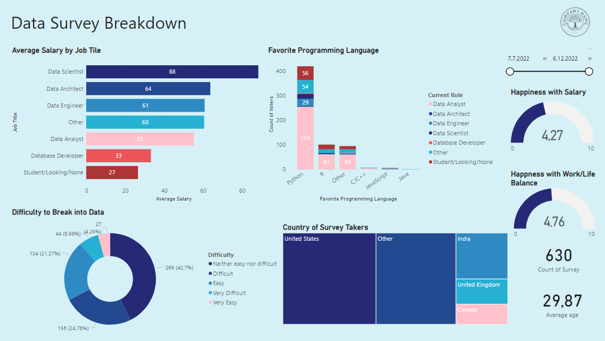
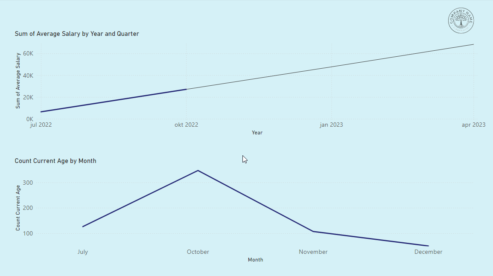

# Power BI Data Survey

Data survey analysis using Power BI.

## Run Localy

Clone the project
```
https://github.com/veronikagregorec/power-bi-data-survey.git
```
Go to the project directory and open ```.pbix``` file with Microsoft Power BI Desktop.

## Power BI Dashboard Preview

Data Page


Trend & Forecasts Page


